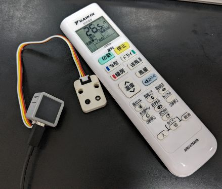

# IR AC control for DAIKIN ARC478A68

DAIKIN ARC478A68 uses an IR protocol so called `DAIKIN312`, but it is not analyzed precisely yet. This project tries to implement IR encoder to control DAIKIN Air Conditioner using the protocol.

## Existing resources

There are some but they're not correctly updated yet...

- [crankyoldgit/IRremoteESP8266 Daikin SetTemp to half degrees #1829](https://github.com/crankyoldgit/IRremoteESP8266/issues/1829)
- [new DAIKIN312](https://docs.google.com/spreadsheets/d/1r3yulakLwdlwXeu_UoALFlzxVsdQYhfSfVmyr0-RBR8/edit#gid=878823975)
